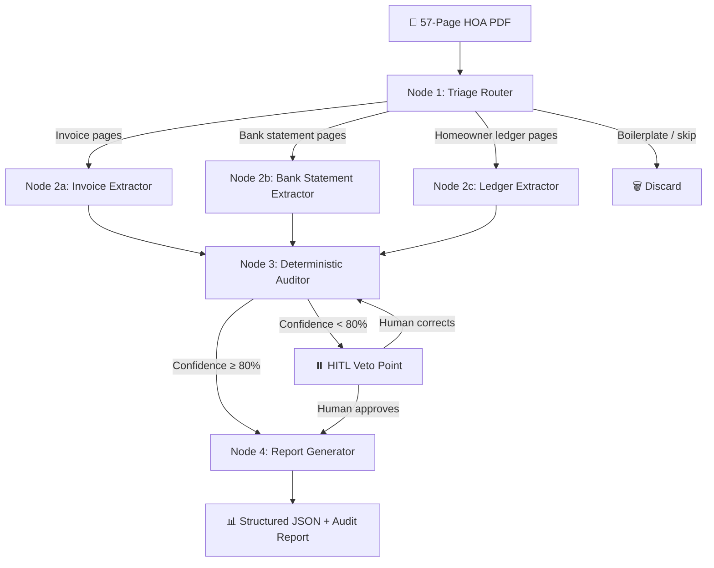

# 🏗️ HOA Financial Audit Swarm — Validated Action Plan

> **Goal:** Build a public GitHub portfolio artifact that demonstrates "Deterministic Stewardship" skills, transitioning from Wells Fargo Senior Dev ($135k) → $200k+ AI role.

---

## ✅ Verified Repos & Resources (All Confirmed Live)

### 1. Core Framework — LangGraph
| | |
|---|---|
| **Repo** | [langchain-ai/langgraph](https://github.com/langchain-ai/langgraph) |
| **Stars** | 28.1k ⭐ |
| **Latest** | v1.1.4 (Mar 31, 2026) |
| **Why** | Durable execution, human-in-the-loop via checkpoints, LangSmith debugging |
| **Install** | `pip install -U langgraph` |

### 2. Financial Extraction Reference — Techno-Tut
| | |
|---|---|
| **Repo** | [Techno-Tut/financialstatement-data-extraction](https://github.com/Techno-Tut/financialstatement-data-extraction) |
| **Stars** | 2 ⭐ |
| **Format** | Jupyter notebook (`structred_data_extraction.ipynb`) |
| **Stack** | LlamaParse + PyPDF fallback → LangChain + GPT-4 → Pydantic models → JSON |

> [!WARNING]
> **Honest Assessment:** This repo is tiny (8 commits, 2 stars). It's useful as a *reference pattern* for how to define Pydantic schemas for bank statements, but do NOT treat it as production-quality code. Use it to understand the *pattern*, then build your own from scratch with LangGraph.

### 3. Supervisor Pattern — LangGraph Supervisor
| | |
|---|---|
| **Repo** | [langchain-ai/langgraph-supervisor-py](https://github.com/langchain-ai/langgraph-supervisor-py) |
| **Stars** | 1.5k ⭐ |
| **Latest** | v0.0.31 |
| **Install** | `pip install langgraph-supervisor` |

> [!IMPORTANT]
> **Key Update from the Repo README:** LangChain now recommends using the supervisor pattern **directly via tools** rather than this library for most use cases. The tool-calling approach gives you more control. Read the [LangChain multi-agent guide](https://docs.langchain.com/oss/python/langchain/multi-agent) and [supervisor tutorial](https://docs.langchain.com/oss/python/langchain/supervisor) first, then decide if you need this library or want to implement the pattern manually (which signals higher engineering competence).

### 4. Type-Safe AI — Pydantic AI
| | |
|---|---|
| **Repo** | [pydantic/pydantic-ai](https://github.com/pydantic/pydantic-ai) |
| **Stars** | 16k ⭐ |
| **Latest** | v1.75.0 (Mar 31, 2026) |
| **Key Features** | Built-in evals (`pydantic_evals`), graph support (`pydantic_graph`), Human-in-the-Loop tool approval, durable execution |

### 5. Learning Resources
| Resource | Link |
|---|---|
| **LangGraph Quickstart** | [docs.langchain.com/oss/python/langgraph/quickstart](https://docs.langchain.com/oss/python/langgraph/quickstart) |
| **LangChain Academy (FREE)** | [academy.langchain.com/courses/intro-to-langgraph](https://academy.langchain.com/courses/intro-to-langgraph) |
| **Multi-Agent Guide** | [docs.langchain.com/oss/python/langchain/multi-agent](https://docs.langchain.com/oss/python/langchain/multi-agent) |
| **Supervisor Tutorial** | [docs.langchain.com/oss/python/langchain/supervisor](https://docs.langchain.com/oss/python/langchain/supervisor) |
| **Human-in-the-Loop** | [docs.langchain.com/oss/python/langgraph/interrupts](https://docs.langchain.com/oss/python/langgraph/interrupts) |
| **Durable Execution** | [docs.langchain.com/oss/python/langgraph/durable-execution](https://docs.langchain.com/oss/python/langgraph/durable-execution) |
| **LlamaParse (Cloud)** | [cloud.llamaindex.ai](https://cloud.llamaindex.ai/) |

---

## 🏛️ Architecture: HOA Financial Audit Swarm



### What Each Node Proves to a Hiring Manager

| Node | Skill Demonstrated | Why It's $200k+ |
|---|---|---|
| **Triage Router** | Context Architecture | Classifies heterogeneous pages → saves 60% token costs |
| **Extractors (2a-2c)** | Specification Precision | Strict Pydantic schemas = zero hallucinated numbers |
| **Auditor** | Failure Pattern Recognition | Python math (NOT AI) cross-checks: `Bank_Deposits == Homeowner_Payments` |
| **Veto Point** | Human-on-the-Loop Governance | LangGraph `interrupt()` with checkpoint persistence |
| **Report Generator** | Production-Ready Building | Deterministic output, audit trail, confidence scores |

---

## 📐 Starter Pydantic Schemas

These are the data contracts your AI must conform to. Define these FIRST before writing any agent logic.

```python
from pydantic import BaseModel, Field
from datetime import date
from enum import Enum
from typing import Optional

class PageType(str, Enum):
    INVOICE = "invoice"
    BANK_STATEMENT = "bank_statement"
    HOMEOWNER_LEDGER = "homeowner_ledger"
    BALANCE_SHEET = "balance_sheet"
    BOILERPLATE = "boilerplate"

class ClassifiedPage(BaseModel):
    page_number: int
    page_type: PageType
    confidence: float = Field(ge=0.0, le=1.0)

class VendorInvoice(BaseModel):
    vendor_name: str
    invoice_number: Optional[str] = None
    invoice_date: date
    due_date: Optional[date] = None
    amount: float = Field(description="Total invoice amount in USD")
    description: str
    source_page: int = Field(description="Page number in original PDF")

class BankTransaction(BaseModel):
    transaction_date: date
    description: str
    amount: float
    transaction_type: str = Field(description="deposit or withdrawal")
    running_balance: Optional[float] = None
    source_page: int

class HomeownerPayment(BaseModel):
    homeowner_name: Optional[str] = None
    unit_or_address: str
    payment_date: date
    amount_due: float
    amount_paid: float
    balance: float
    source_page: int

class AuditResult(BaseModel):
    total_deposits: float
    total_homeowner_payments: float
    discrepancy: float = Field(description="deposits - payments, should be ~0")
    total_vendor_invoices: float
    total_withdrawals: float
    invoice_vs_withdrawal_gap: float
    flagged_issues: list[str] = Field(default_factory=list)
    confidence_score: float = Field(ge=0.0, le=1.0)
    requires_human_review: bool
```

---

## 📅 90-Day Execution Plan

### Phase 1: Learn (Days 1–14)
- [ ] Complete [LangChain Academy LangGraph Course](https://academy.langchain.com/courses/intro-to-langgraph) (FREE)
- [ ] Run the [LangGraph Quickstart](https://docs.langchain.com/oss/python/langgraph/quickstart) locally
- [ ] Clone `Techno-Tut/financialstatement-data-extraction`, study the Pydantic schema pattern
- [ ] Sign up for [LlamaParse](https://cloud.llamaindex.ai/) free tier (1k pages/day)
- [ ] Run a 5-page sample of your HOA PDF through LlamaParse to see output quality
- [ ] Read the [Human-in-the-Loop docs](https://docs.langchain.com/oss/python/langgraph/interrupts) — this is your key differentiator

### Phase 2: Build (Days 15–60)
- [ ] Create your GitHub repo: `hoa-financial-audit-swarm`
- [ ] Define all Pydantic schemas (use starter above, adapt to YOUR actual HOA format)
- [ ] Build Node 1: Triage Router (classify pages using VLM or structured output)
- [ ] Build Node 2a: Invoice Extractor with strict Pydantic output
- [ ] Build Node 2b: Bank Statement Extractor
- [ ] Build Node 2c: Homeowner Ledger Extractor
- [ ] Build Node 3: Deterministic Auditor (Python math, NOT LLM math)
- [ ] Build Node 4: Report Generator (JSON + human-readable markdown)
- [ ] Implement `interrupt()` for the HITL Veto Point
- [ ] Implement `MemorySaver` checkpointing for state persistence
- [ ] Wire it all together as a LangGraph `StateGraph`

### Phase 3: Prove (Days 61–90)
- [ ] Create `evals/` folder with 50+ "Golden Examples" from real HOA data
- [ ] Use `pydantic_evals` or Ragas to measure extraction accuracy (target: 95%+)
- [ ] Write a `FAILURE_LOG.md` documenting failures you found and how you solved them
- [ ] Add LangSmith integration for observability traces
- [ ] Write a professional `README.md` with architecture diagram, demo GIF, and accuracy metrics
- [ ] Add a `COST_ANALYSIS.md` showing token economics (cost per document processed)
- [ ] Publish to GitHub, pin it to your profile

---

## 🎯 The 5 Things That Make This Repo Worth $200k+

1. **`evals/` folder** — Automated accuracy testing, not "vibes." This is *the* #1 signal.
2. **`interrupt()` veto point** — Proves you understand governance for high-stakes data.
3. **Python math for auditing** — Shows you know when NOT to use AI (deterministic > probabilistic).
4. **Failure Pattern Recognition docs** — A `FAILURE_LOG.md` showing how you categorized and solved extraction failures (Specification vs. Context vs. Architecture failures).
5. **Real data, real problem** — Not a tutorial clone. This is YOUR HOA document, a messy real-world problem.

---

## ⚠️ Corrections to Gemini's Recommendations

| What Gemini Said | What's Actually True |
|---|---|
| "Use `langgraph-supervisor` library" | The library's own README now says: **use the manual supervisor pattern via tools for more control.** The manual approach is a stronger engineering signal. |
| "Techno-Tut repo is a great financial extraction blueprint" | It has **2 stars and 8 commits**. Learn from the pattern, but build from scratch. |
| "Use Ragas or Arize for evals" | Pydantic AI now has **built-in `pydantic_evals`** (see their repo's `pydantic_evals/` folder). This is the more aligned choice since your whole stack is Pydantic-based. |
| "OpenAI Swarm is for learning" | Correct. Avoid it. Stick with LangGraph. |

---

## 🔑 API Keys You'll Need

| Service | Purpose | Cost |
|---|---|---|
| **OpenAI** (GPT-4o / GPT-4.1) | Extraction LLM | ~$2.50/1M input tokens |
| **LlamaParse** | PDF → structured markdown | Free tier: 1k pages/day |
| **LangSmith** (optional) | Debugging agent traces | Free tier available |

---

## Next Step

**Your Day 1 action is simple:** Sign up for [LangChain Academy](https://academy.langchain.com/courses/intro-to-langgraph) and start the free LangGraph course. While that's running, upload 5 pages of your HOA PDF to [LlamaParse](https://cloud.llamaindex.ai/) to see how it handles your specific tables and invoices.

When you're ready to start coding, come back and I'll help you build Node 1 (the Triage Router) step by step.
